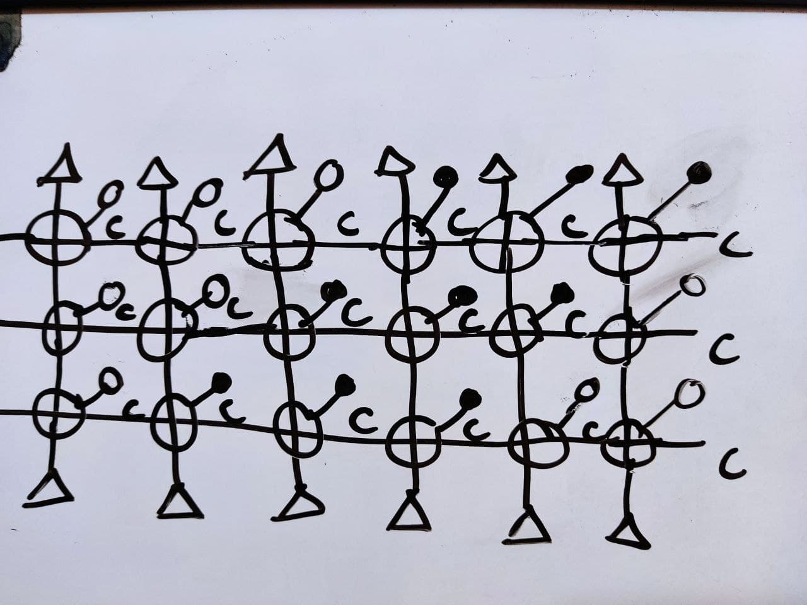
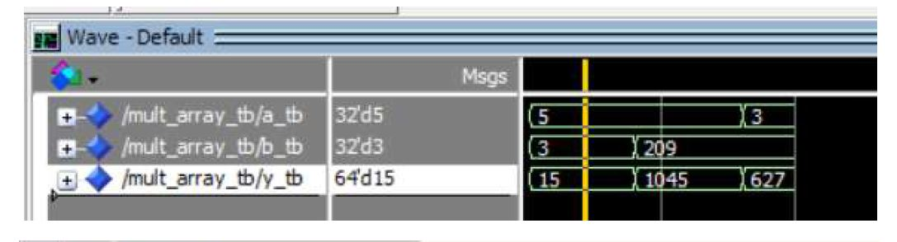
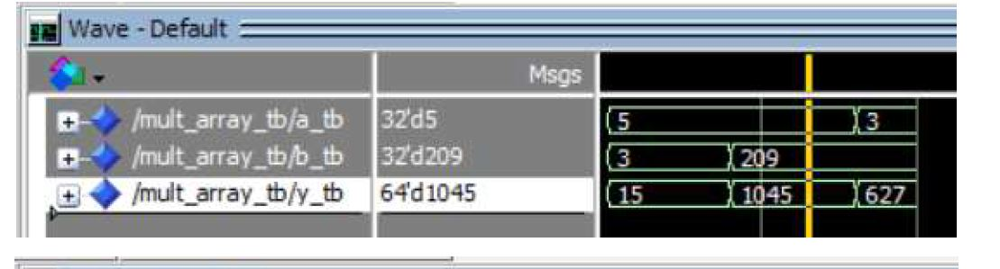
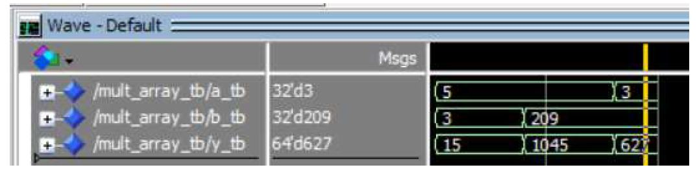

# HOW TO MINIMIZE THE FOR GENERATE BLOCKS IN VHDL
this is a bad example with an unnecessary hardware size.
but it works in the simulation.
if found any solution to minimize the code for-gen blocks in sub-matrix assignment please don't hesitate to share. my contact info is available at my github [profile](https://github.com/ph504)

## HARDWARE STRUCTURE
this picture indicates a 3*3 array multiplier in my design which has only 9 essential adders and other adders add the bit with just zero to minimize the for-blocks.

## THE SIMULATION RESULTS:
the results in the modelsim are as follows

